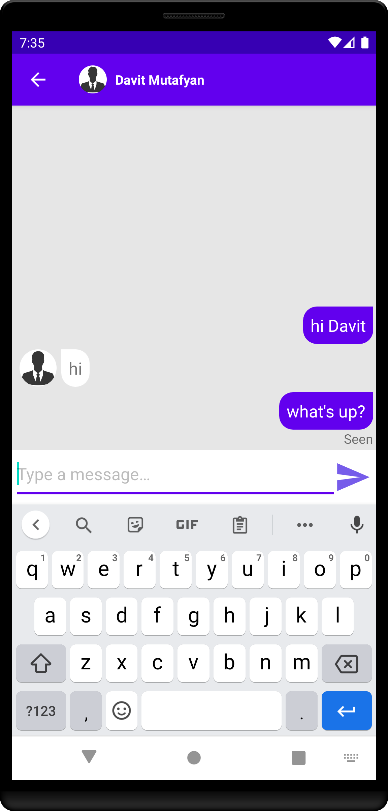

# D-Chat

**D-Chat** is an Android chatting app based on ***Firebase***. Therefore it is lightweight, simple, but yet powerful, fast and reliable for simple tasks.

## **Registration**

Registration is done with this **registration page**.
User is promted to insert info needed for registration  | Example of inserted data  
:-------------------------:|:-------------------------:
| 

On registration button pressed the entered data is examined and checked for illegal symbols.
Email syntax is checked.

Fields cannot be blank     |  Email must contain '@' and '.', and not contain other symbols
:-------------------------:|:-------------------------:
 | 

If the data is valid, the user is registered, and the user is taken to the [Main Activity](#main-activity):

```java
private void Register(String name, String email, String password) {
        progressBar.setVisibility(View.VISIBLE); // Indicate that the registration process started
        // Create new User with email and password
        fAuth.createUserWithEmailAndPassword(email, password).addOnCompleteListener(new OnCompleteListener<AuthResult>() {
            @Override
            public void onComplete(@NonNull @NotNull Task<AuthResult> task) {
                if(task.isSuccessful())
                {
                    FirebaseUser currentUser = fAuth.getCurrentUser();
                    assert currentUser != null;
                    String userID = currentUser.getUid();
                    // Current users new collection of data under his UID
                    DatabaseReference users = database.getReference("Users");

                    // Create hashmap with user's data
                    HashMap<String, String> userinfo = new HashMap<>();
                    userinfo.put("id", userID);
                    userinfo.put("username", name);
                    userinfo.put("email", email);
                    userinfo.put("imageURL", "default");
                    userinfo.put("status", "offline");

                    // Upload the data to the database and set a listener
                    users.child(userID).setValue(userinfo).addOnCompleteListener(new OnCompleteListener<Void>() {
                        @Override
                        public void onComplete(@NonNull @NotNull Task<Void> task) {
                            if(task.isSuccessful()){
                                // If successful - move to main activity
                                Intent main = new Intent(getApplicationContext(), MainActivity.class);
                                main.addFlags(Intent.FLAG_ACTIVITY_CLEAR_TASK | Intent.FLAG_ACTIVITY_NEW_TASK);
                                startActivity(main);
                                // Toast welcome message
                                Toast.makeText(getApplicationContext(), "User Created. Welcome!", Toast.LENGTH_SHORT).show();
                                finish();
                            } else {
                                // Log error message
                                Log.d(TAG, task.getException().getMessage());
                                progressBar.setVisibility(View.GONE);
                            }
                        }
                    });
                }
                else {
                    // Toast error message
                    Toast.makeText(getApplicationContext(), "Error! " + Objects.requireNonNull(task.getException()).getMessage(), Toast.LENGTH_SHORT).show();
                    progressBar.setVisibility(View.GONE);
                }
            }
        });
    }
```

## **Login**

If a user already has an account, he can move to the [login page](#login-page) by clicking the textview under registration button.

### **Login page**


Here the user is promted to enter his email and password. On login button press the entered data is checked and if is valid, the user is **logged in**:

```java
loginButton.setOnClickListener(new View.OnClickListener() {
            @Override
            public void onClick(View v) {
                String email = Objects.requireNonNull(emailET.getText()).toString();
                String password = Objects.requireNonNull(passwordET.getText()).toString();
                progressBar.setVisibility(View.VISIBLE);
                if(data_ok(email, password)){ // data was ok -- proceed with signing in
                    fAuth.signInWithEmailAndPassword(email, password).addOnSuccessListener(new OnSuccessListener<AuthResult>() {
                        @Override
                        public void onSuccess(AuthResult authResult) {
                            progressBar.setVisibility(View.GONE);
                            Toast.makeText(getApplicationContext(), "Logged in successfully", Toast.LENGTH_SHORT).show();
                            // Display debug info
                            Log.d(TAG, "LoginSuccess: Logged in user " + Objects.requireNonNull(fAuth.getCurrentUser()).getUid());
                            Intent main = new Intent(getApplicationContext(), MainActivity.class);
                            main.addFlags(Intent.FLAG_ACTIVITY_CLEAR_TASK | Intent.FLAG_ACTIVITY_NEW_TASK);
                            startActivity(main);
                            finish();
                        }
                    }).addOnFailureListener(new OnFailureListener() {
                        @Override
                        public void onFailure(@NonNull @NotNull Exception e) {
                            progressBar.setVisibility(View.INVISIBLE);
                            Toast.makeText(getApplicationContext(), "Login failed! " + e.getMessage(), Toast.LENGTH_SHORT).show();
                            Log.d(TAG,"LoginFailure: " + e.toString());
                        }
                    });
                } else { // data was not ok
                    progressBar.setVisibility(View.INVISIBLE);
                    return;
                }
            }
        });
```

## **Reset password**

If the user has forgot his password he can reset it by clicking the "Forgot your password?" textview.
A new activity is started where the user is promted to enter his account's login info.


An email is sent to the entered address with **reset link**.


After clicking the link a new page is opened with password reset window:


The entered new password then is saved and applied.

## **Main Activity**

The main activity is a tab layout with 2 fragments - [Chats Fragment](#chats-fragment) and [Users Fragment](#users-fragment) and with a [3 dot menu](./about_pics/3dot.png) where the user can open his [profile](#profile) or logout.

### **Profile**

On the 3 dot menu item click the profile activity is started, where the user can see his account info (public name and e-mail), and also his profile picture. Profile picture can be changed by clicking on it. The user will be promted to choose an image from his files and then the selected image will be uploaded to  Firebase Storage, and the user's profile picture will be visible for all the D-Chat users.

Profile with default profile picture |  Profile after posting custom profile picture
:-------------------------:|:-------------------------:
 | 

### **Users Fragment**

Here you can see a list of *all users* of D-Chat. And *by clicking on them you can start a [new chat with the selected user](#message-activity)*.


Here the user can also ***search*** for users:


### **Chats Fragment**

Here are listed all the chats of the user. When user starts a new chat - a new item with receiver user is added to the list. By clicking on that item you can open the chat with that user.

The chat item includes the receiver's name, profile picture, activity status and the last message of the chat. If the last message is not seen yet, it is showing in bold style.


## **Message Activity**

When a chat item clicked a message activity starts featuring sender and receiver users.
The last message is delivered but not seen yet | The last message is seen
:-------------------------:|:-------------------------:
 | 

### **Message**

On send button click the entered message is checked if it is empty or if it is longer than maximum allowed message size (150 characters by default. Is regulated by *MAX_MESSAGE_SIZE* parameter, can be changed)

If everything is okay, the message is sent.

**Message Structure** :


A message contains several fields describing it:

- the status field
- receiver id
- sender id
- and the message itself (the messages are not being encrypted yet, but will be in the future).
After the message is seen, the "isseen" field turns "true"

## Post Scriprum

To use the app you will have to get google-services.json file which is generated by Google when adding an app to Firebase.
Download the file and put it in the "app" folder

Author: **Davit Mutafyan**
